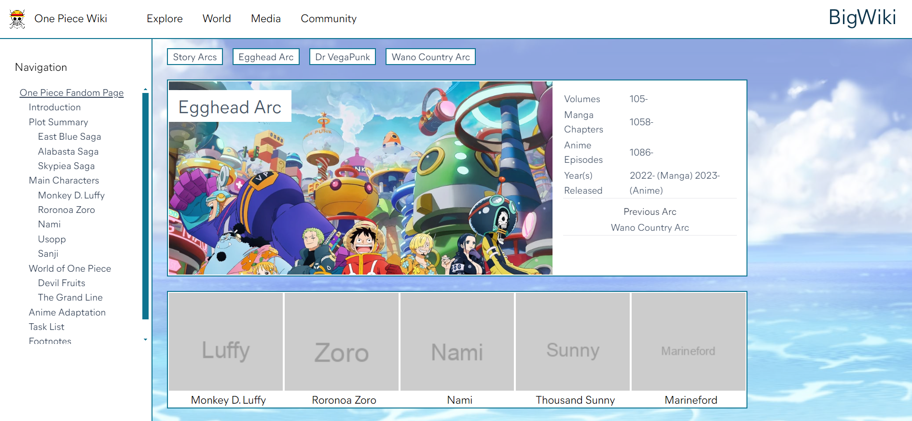

# A modern/better open-source software alternative for fandom/mediawiki

## Contribution Guide

    Fork, commit and pull request

## Architecture

## Frontend
- Sveltekit
- TailwindCSS

## Backend
- Go (net/http)
- Redis (if needed)
- PostgreSQL

## Website structure

- /         :Landing page of the wiki, loaded by db data request
- /wiki/    :Base wiki pages of the websites paths will be mixed case with hypens (ex: Egghead-Arc)

## DB structure

- All websites are loaded from DB data (currently can bee seen in the data/ dir), maybe routed through Redis if high traffic

